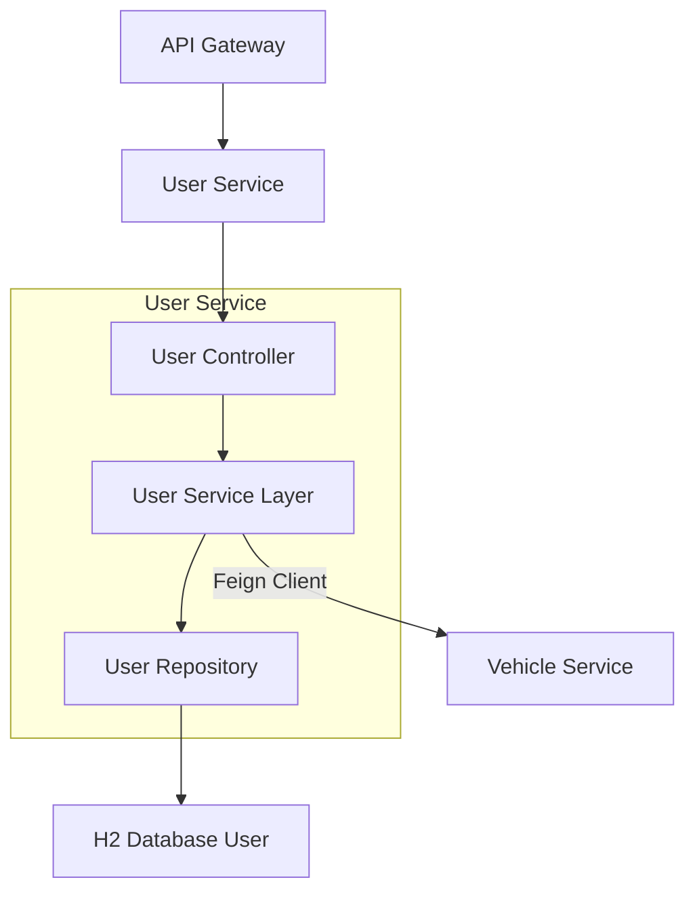
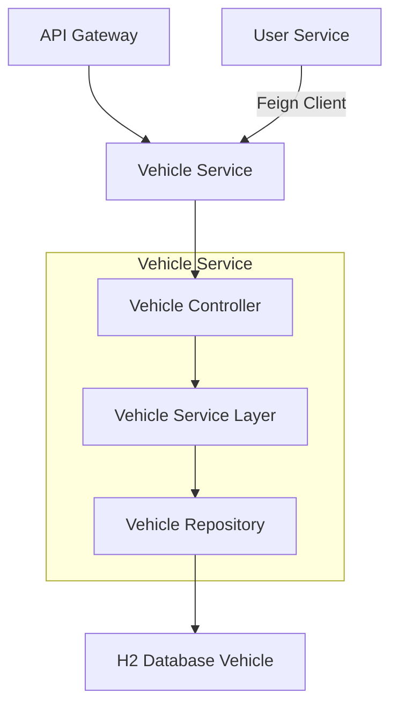
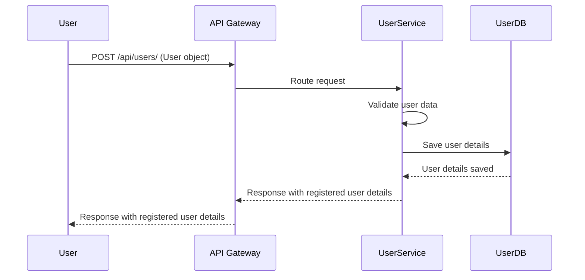
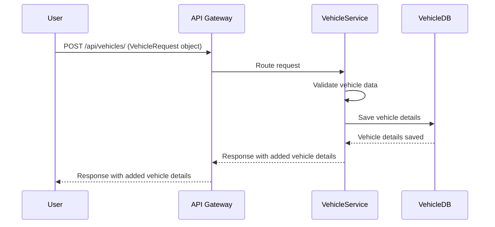

# Vehicle Management System

The Vehicle Management System is a microservices-based application designed to manage users and their associated vehicles. It comprises several interconnected services that work together to provide a comprehensive solution for vehicle and user management.

---

## Project Overview

This system is built using a microservices architecture, leveraging Spring Boot and Spring Cloud to create a scalable and resilient application. The core functionalities include user registration and management, vehicle addition and retrieval, service discovery, and API routing.

---

## Architecture

The system is composed of the following microservices:

### User Service

* **Description**: Handles all user-related operations, including registration, retrieval, and association with vehicles.
* **Functionality**: Performs CRUD (Create, Read, Update, Delete) operations for users.
* **Communication**: Communicates with the Vehicle Service using **Feign Client** to fetch vehicle-related data for a given user.

### User Service Architecture

### Vehicle Service

* **Description**: Manages vehicle-related operations.
* **Functionality**: Handles CRUD operations for vehicles and provides endpoints for retrieving vehicle details.

### Vehicle Service Architecture

### Eureka Discovery Service

* **Description**: Provides service discovery functionality for all microservices.
* **Functionality**: Enables service registration and discovery, ensuring dynamic scaling and fault tolerance within the microservices ecosystem.

### API Gateway

* **Description**: Acts as a single entry point for all microservices.
* **Functionality**: Routes incoming requests to the appropriate microservices, provides centralized authentication, and handles logging.

---

## Technology Stack

* **Programming Language**: Java
* **Frameworks**: Spring Boot, Spring Cloud
* **Database**: H2 (In-memory database)
* **Service Discovery**: Eureka
* **API Gateway**: Spring Cloud Gateway
* **Build Tool**: Maven

---

## Database Table Design

### User Table

| Column Name  | Data Type    | Constraints                  | Description                         |
| :----------- | :----------- | :--------------------------- | :---------------------------------- |
| `userId`     | `BIGINT`     | Primary Key, Auto-Increment  | Unique identifier for the user      |
| `name`       | `VARCHAR(255)` | NOT NULL                     | Name of the user                    |
| `email`      | `VARCHAR(255)` | NOT NULL, UNIQUE             | Email address of the user           |
| `phone`      | `VARCHAR(15)`  | NOT NULL                     | Phone number of the user            |
| `address`    | `VARCHAR(255)` |                              | Address of the user                 |
| `passwordHash` | `VARCHAR(255)` | NOT NULL                     | Hashed password of the user         |

### Vehicle Table

| Column Name | Data Type    | Constraints                 | Description                       |
| :---------- | :----------- | :-------------------------- | :-------------------------------- |
| `vehicleId` | `BIGINT`     | Primary Key, Auto-Increment | Unique identifier for the vehicle |
| `make`      | `VARCHAR(255)` | NOT NULL                    | Manufacturer of the vehicle       |
| *(Additional vehicle details like model, year, etc., would be added here)* | | | |

---

## Endpoints

### User Service Endpoints

| Endpoint                  | Method | Description                      | Request Body/Params           |
| :------------------------ | :----- | :------------------------------- | :---------------------------- |
| `/api/users/`             | `POST` | Register a new user              | `User` object                 |
| `/api/users/{email}`      | `GET`  | Retrieve user by email           | `email` (Path Variable)       |
| `/api/users`              | `GET`  | Retrieve all users               | None                          |
| `/api/users/{userId}/vehicles` | `GET`  | Retrieve vehicles associated with a user | `userId` (Path Variable) |

### Vehicle Service Endpoints

| Endpoint                  | Method | Description           | Request Body/Params             |
| :------------------------ | :----- | :-------------------- | :------------------------------ |
| `/api/vehicles/`          | `POST` | Add a new vehicle     | `VehicleRequest` object         |
| `/api/vehicles/user/{userId}` | `GET`  | Retrieve vehicles by user ID | `userId` (Path Variable) |

---

## Sequence Diagrams

### User Registration

### Vehicle Registration

