## Table of Contents

- [Overview](#overview)
- [Component Diagram](#component-diagram)
- [Key Features](#key-features)
- [Database Table Design](#database-table-design)
- [Endpoints](#endpoints)
- [Sequence Diagrams](#sequence-diagrams)
- [Swagger Documentation](#swagger-documentation)

## Overview

The **User Service** is a core microservice in the system responsible for managing user-related operations such as registration, retrieval, and vehicle association. It communicates with the **Vehicle Service** using a **Feign Client** to fetch vehicle data.

---

## Component Diagram

```mermaid
graph TD
    style A fill:#f9f,stroke:#333,stroke-width:2px
    style B fill:#bbf,stroke:#333,stroke-width:2px
    style C fill:#bfb,stroke:#333,stroke-width:2px
    style D fill:#bff,stroke:#333,stroke-width:2px
    style E fill:#ffb,stroke:#333,stroke-width:2px
    style F fill:#fbb,stroke:#333,stroke-width:2px
 
    A[📡 API Gateway] --> B[🛠️ User Service]
    B --> C[📂 Controller]
    C --> D[⚙️ Service Layer]
    D --> E[🗃️ Repository]
    E --> F[🛢️ H2 Database - User]
 
    subgraph User Service
        C
        D
        E
    end
```



## Key Features
- **User Registration**
    - Allows new users to sign up by providing personal details such as name, email, phone number, and address.

- **Profile Management**
    - Enables users to view and update their profile information securely.

- **Service History Tracking**
    - Maintains a record of vehicle-related services associated with each user, offering insights into past interactions and maintenance.

- **Vehicle Association**
    - Links users to their registered vehicles, enabling seamless access to vehicle data via Feign Client integration with the Vehicle Service.

- **User Lookup**
    - Supports searching users by email or listing all registered users for administrative or analytical purposes.

## Database Table Design

### User Table

| Column Name  | Data Type    | Constraints                  | Description                         |
| :----------- | :----------- | :--------------------------- | :---------------------------------- |
| `userId`     | `BIGINT`     | Primary Key, Auto-Increment  | Unique identifier for the user      |
| `name`       | `VARCHAR(255)` | NOT NULL                     | Name of the user                    |
| `email`      | `VARCHAR(255)` | NOT NULL, UNIQUE             | Email address of the user           |
| `phone`      | `VARCHAR(15)`  | NOT NULL                     | Phone number of the user            |
| `address`    | `VARCHAR(255)` |                              | Address of the user                 |
| `passwordHash` | `VARCHAR(255)` | NOT NULL                     | Hashed password of the user         |

## Endpoints

### User Service Endpoints

| Endpoint                  | Method | Description                      | Request Body/Params           |
| :------------------------ | :----- | :------------------------------- | :---------------------------- |
| `/api/users/`             | `POST` | Register a new user              | `User` object                 |
| `/api/users/{email}`      | `GET`  | Retrieve user by email           | `email` (Path Variable)       |
| `/api/users`              | `GET`  | Retrieve all users               | None                          |
| `/api/users/{userId}/vehicles` | `GET`  | Retrieve vehicles associated with a user | `userId` (Path Variable) |

## Sequence Diagrams

### User Registration


## Swagger Documentation
The User Service provides interactive API documentation using Swagger.

### Access Swagger UI
Swagger UI for User Service
    - http://localhost:8082/swagger-ui/index.html


## 🚀 How to Run the Vehicle Management System

### Step-by-Step Commands

```bash
# 1. Clone the repository
git clone https://github.com/siddhi-kate/vehicle-management-system.git
cd vehicle-management-system

# 2. Build all services
mvn clean install

# 3. Run Eureka Discovery Service
cd eureka-service
mvn spring-boot:run

# 4. Run API Gateway
cd ../api-gateway
mvn spring-boot:run

# 5. Run User Service
cd ../user-service
mvn spring-boot:run

# 6. Run Vehicle Service
cd ../vehicle-service
mvn spring-boot:run
```

