## 📚 Table of Contents

- [User Service](#user-service)
- [Component Diagram](#component-diagram)
- [Key Features](#key-features)
- [Database Table Design](#database-table-design)
- [Endpoints](#endpoints)
- [Sequence Diagrams](#sequence-diagrams)
- [Swagger Documentation](#swagger-documentation)

# 🛠️ User Service

The **User Service** is a core microservice in the system responsible for managing user-related operations such as registration, retrieval, and vehicle association. It communicates with the **Vehicle Service** using a **Feign Client** to fetch vehicle data.

---

## Component Diagram

```mermaid
graph TD
    style A fill:#f9f,stroke:#333,stroke-width:2px
    style B fill:#bbf,stroke:#333,stroke-width:2px
    style C fill:#bfb,stroke:#333,stroke-width:2px
    style D fill:#bff,stroke:#333,stroke-width:2px
    style E fill:#ffb,stroke:#333,stroke-width:2px
    style F fill:#fbb,stroke:#333,stroke-width:2px
 
    A[📡 API Gateway] --> B[🛠️ User Service]
    B --> C[📂 Controller]
    C --> D[⚙️ Service Layer]
    D --> E[🗃️ Repository]
    E --> F[🛢️ H2 Database - User]
 
    subgraph User Service
        C
        D
        E
    end
```



## Key Features
- **User Registration**
    - Allows new users to sign up by providing personal details such as name, email, phone number, and address.

- **Profile Management**
    - Enables users to view and update their profile information securely.

- **Service History Tracking**
    - Maintains a record of vehicle-related services associated with each user, offering insights into past interactions and maintenance.

- **Vehicle Association**
    - Links users to their registered vehicles, enabling seamless access to vehicle data via Feign Client integration with the Vehicle Service.

- **User Lookup**
    - Supports searching users by email or listing all registered users for administrative or analytical purposes.

## Database Table Design

### User Table

| Column Name  | Data Type    | Constraints                  | Description                         |
| :----------- | :----------- | :--------------------------- | :---------------------------------- |
| `userId`     | `BIGINT`     | Primary Key, Auto-Increment  | Unique identifier for the user      |
| `name`       | `VARCHAR(255)` | NOT NULL                     | Name of the user                    |
| `email`      | `VARCHAR(255)` | NOT NULL, UNIQUE             | Email address of the user           |
| `phone`      | `VARCHAR(15)`  | NOT NULL                     | Phone number of the user            |
| `address`    | `VARCHAR(255)` |                              | Address of the user                 |
| `passwordHash` | `VARCHAR(255)` | NOT NULL                     | Hashed password of the user         |

## Endpoints

### User Service Endpoints

| Endpoint                  | Method | Description                      | Request Body/Params           |
| :------------------------ | :----- | :------------------------------- | :---------------------------- |
| `/api/users/`             | `POST` | Register a new user              | `User` object                 |
| `/api/users/{email}`      | `GET`  | Retrieve user by email           | `email` (Path Variable)       |
| `/api/users`              | `GET`  | Retrieve all users               | None                          |
| `/api/users/{userId}/vehicles` | `GET`  | Retrieve vehicles associated with a user | `userId` (Path Variable) |

## Sequence Diagrams

### User Registration


## Swagger Documentation
The User Service provides interactive API documentation using Swagger.

### Access Swagger UI
Swagger UI for User Service
    - http://localhost:8082/swagger-ui/index.html


# Vehicle Management System


## 📚 Table of Contents

- [Project Overview](#project-overview)
- [Architecture](#architecture)
  - [User Service](#user-service)
  - [User Service Component Diagram](#user-service-component-diagram)
  - [Vehicle Service](#vehicle-service)
  - [Vehicle Service Component Diagram](#vehicle-service-component-diagram)
  - [Eureka Discovery Service](#eureka-discovery-service)
  - [API Gateway](#api-gateway)
- Technology Stack
- Database Table Design
  - User Table
  - Vehicle Table
- [Endpoints](#endpoints)
  - User Service Endpoints
  - Vehicle Service Endpoints
- [Sequence Diagrams](#sequence-diagrams)
  - User Registration
  - Vehicle Registration
- 🚀 How to Run the Vehicle Management System


The Vehicle Management System is a microservices-based application designed to manage users and their associated vehicles. It comprises several interconnected services that work together to provide a comprehensive solution for vehicle and user management.

---

## Project Overview

This system is built using a microservices architecture, leveraging Spring Boot and Spring Cloud to create a scalable and resilient application. The core functionalities include user registration and management, vehicle addition and retrieval, service discovery, and API routing.

---

## Architecture

The system is composed of the following microservices:

### User Service

* **Description**: Handles all user-related operations, including registration, retrieval, and association with vehicles.
* **Functionality**: Performs CRUD (Create, Read, Update, Delete) operations for users.
* **Communication**: Communicates with the Vehicle Service using **Feign Client** to fetch vehicle-related data for a given user.

### User Service Component Diagram


### Vehicle Service

* **Description**: Manages vehicle-related operations.
* **Functionality**: Handles CRUD operations for vehicles and provides endpoints for retrieving vehicle details.

### Vehicle Service Component Diagram


### Eureka Discovery Service

* **Description**: Provides service discovery functionality for all microservices.
* **Functionality**: Enables service registration and discovery, ensuring dynamic scaling and fault tolerance within the microservices ecosystem.

### API Gateway

* **Description**: Acts as a single entry point for all microservices.
* **Functionality**: Routes incoming requests to the appropriate microservices, provides centralized authentication, and handles logging.

---

## Technology Stack

* **Programming Language**: Java
* **Frameworks**: Spring Boot, Spring Cloud
* **Database**: H2 (In-memory database)
* **Service Discovery**: Eureka
* **API Gateway**: Spring Cloud Gateway
* **Build Tool**: Maven

---


#### Vehicle Table

| Column Name         | Data Type      | Constraints                 | Description                             |
|---------------------|----------------|------------------------------|-----------------------------------------|
| `vehicleId`         | `BIGINT`       | Primary Key, Auto-Increment | Unique identifier for the vehicle       |
| `userId`            | `BIGINT`       | Foreign Key, NOT NULL       | ID of the user who owns the vehicle     |
| `make`              | `VARCHAR(255)` | NOT NULL                    | Manufacturer of the vehicle             |
| `model`             | `VARCHAR(255)` | NOT NULL                    | Model name of the vehicle               |
| `year`              | `INT`          | NOT NULL                    | Manufacturing year of the vehicle       |
| `registrationNumber`| `VARCHAR(50)`  | NOT NULL, UNIQUE            | Vehicle's registration number           |


---


#### Vehicle Service Endpoints

| Endpoint                                | Method | Description                        | Request Body/Params         |
|-----------------------------------------|--------|------------------------------------|------------------------------|
| `/api/vehicles/`                        | POST   | Add a new vehicle                  | `VehicleRequest` object      |
| `/api/vehicles/user/{userId}`           | GET    | Retrieve vehicles by user ID       | `userId` (Path Variable)     |
| `/api/vehicles/{vehicleId}`             | GET    | Retrieve vehicle by vehicle ID     | `vehicleId` (Path Variable)  |
| `/api/vehicles/{vehicleId}`             | PUT    | Update vehicle details             | `VehicleRequest` object      |
| `/api/vehicles/{vehicleId}`             | DELETE | Delete a vehicle                   | `vehicleId` (Path Variable)  |

---


### Vehicle Registration


## 🚀 How to Run the Vehicle Management System

### Step-by-Step Commands

```bash
# 1. Clone the repository
git clone https://github.com/siddhi-kate/vehicle-management-system.git
cd vehicle-management-system

# 2. Build all services
mvn clean install

# 3. Run Eureka Discovery Service
cd eureka-service
mvn spring-boot:run

# 4. Run API Gateway
cd ../api-gateway
mvn spring-boot:run

# 5. Run User Service
cd ../user-service
mvn spring-boot:run

# 6. Run Vehicle Service
cd ../vehicle-service
mvn spring-boot:run
```

