# Vehicle Service

## Table of Contents

- [Overview](#overview)
- [Component Diagram](#component-diagram)
- [Key Features](#key-features)
- [Database Table Design](#database-table-design)
- [Endpoints](#endpoints)
- [Sequence Diagrams](#sequence-diagrams)
- [Swagger Documentation](#swagger-documentation)

---

## Overview

The **Vehicle Service** is a core microservice in the system responsible for managing vehicle-related operations such as creation, retrieval, update, and deletion. It integrates with the **User Service** via Feign Client to fetch user-specific vehicle data.

---

## Component Diagram

```mermaid
graph TD
    style A fill:#f9f,stroke:#333,stroke-width:2px
    style B fill:#bbf,stroke:#333,stroke-width:2px
    style C fill:#bfb,stroke:#333,stroke-width:2px
    style D fill:#bff,stroke:#333,stroke-width:2px
    style E fill:#ffb,stroke:#333,stroke-width:2px
    style F fill:#fbb,stroke:#333,stroke-width:2px
 
    A[📡 API Gateway] --> B[🛠️ Vehicle Service]
    B --> C[📂 Controller]
    C --> D[⚙️ Service Layer]
    D --> E[🗃️ Repository]
    E --> F[🛢️ H2 Database - Vehicle]
 
    subgraph Vehicle Service
        C
        D
        E
    end
```

---

## Key Features
- **Vehicle Registration**
    - Allows users to register new vehicles with details like make, model, year, and registration number.

- **Vehicle Management**
    - Supports updating and deleting vehicle records.

- **Vehicle Lookup**
    - Enables retrieval of vehicle details by vehicle ID or user ID.

- **User-Vehicle Association**
    - Associates vehicles with users using foreign key relationships.

- **Feign Integration**
    - Communicates with the User Service to fetch user-related data.

---

## Database Table Design
---
#### Vehicle Table

| Column Name         | Data Type      | Constraints                 | Description                             |
|---------------------|----------------|------------------------------|-----------------------------------------|
| `vehicleId`         | `BIGINT`       | Primary Key, Auto-Increment | Unique identifier for the vehicle       |
| `userId`            | `BIGINT`       | Foreign Key, NOT NULL       | ID of the user who owns the vehicle     |
| `make`              | `VARCHAR(255)` | NOT NULL                    | Manufacturer of the vehicle             |
| `model`             | `VARCHAR(255)` | NOT NULL                    | Model name of the vehicle               |
| `year`              | `INT`          | NOT NULL                    | Manufacturing year of the vehicle       |
| `registrationNumber`| `VARCHAR(50)`  | NOT NULL, UNIQUE            | Vehicle's registration number           |

---

## Endpoints

#### Vehicle Service Endpoints

| Endpoint                                | Method | Description                        | Request Body/Params         |
|-----------------------------------------|--------|------------------------------------|------------------------------|
| `/api/vehicles/`                        | POST   | Add a new vehicle                  | `VehicleRequest` object      |
| `/api/vehicles/user/{userId}`           | GET    | Retrieve vehicles by user ID       | `userId` (Path Variable)     |
| `/api/vehicles/{vehicleId}`             | GET    | Retrieve vehicle by vehicle ID     | `vehicleId` (Path Variable)  |
| `/api/vehicles/{vehicleId}`             | PUT    | Update vehicle details             | `VehicleRequest` object      |
| `/api/vehicles/{vehicleId}`             | DELETE | Delete a vehicle                   | `vehicleId` (Path Variable)  |

---

## Sequence Diagrams

### Vehicle Registration

## Swagger Documentation
The Vehicle Service provides interactive API documentation using Swagger.

### Access Swagger UI
Swagger UI for Vehicle Service
    - http://localhost:8083/swagger-ui/index.html
